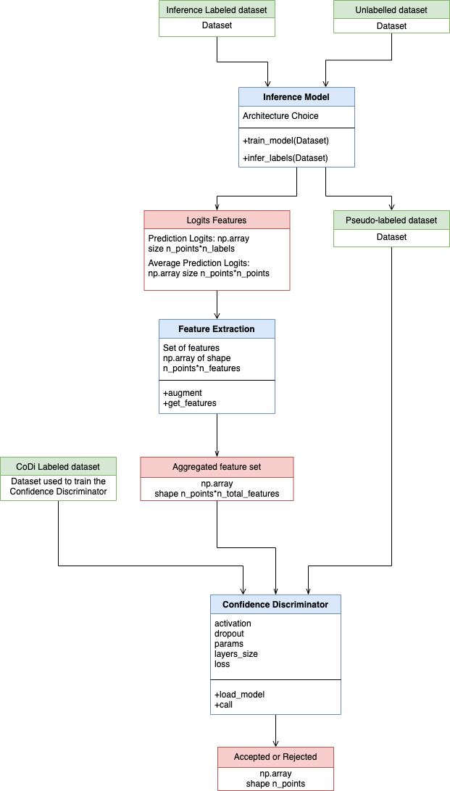

# Data Valuation

Data Valuation provides three main blocks as shown in the diagram below:
1. An inference model that takes as input the data
2. A feature extractor that will compute features based on the raw ones.
3. A CoDi (Confidence Discriminator) that will accept/reject the datapoints.  



## Features

* A highly modular end-to-end framework:

    * Easily customizable inference model : researchers can plug their own inference model or tune the one provided.
    * Easily customizable confidence discriminator model : researchers can plug their own codi or tune the one provided. 
    * Any Inference model can be used (tested on images, NLP, speech)
    * Customizable plug-n-play feature processing : can easily choose which features to keep, add or remove.
    * Customizable datasets by dataset classes inheritence.
    
## Speech Dataset

The LibriSpeech corpus is a large (1000 hour) corpus of English read speech
 derived from audiobooks in the LibriVox project, sampled at 16kHz.  The
 accents are various and not marked, but the majority are US English.  It is
 available for download for free at http://www.openslr.org/12/.  It was prepared
 as a speech recognition corpus by Vassil Panayotov.
 
 ## Directory Layout
 
 ```bash
|-- codi
    |-- train_codi.yaml
    |-- mlp_codi.yaml
    |-- mlp_codi.py
    |-- ...
|-- dataset
|-- env
|-- features
    |-- features_classes
    |-- features_tests
|-- inference_models
|-- main.py
|-- main_speech.py
|-- retraining_experiment.py
|-- preprocessing
|-- README.md
|-- speech_inference
    |-- local
    |-- run.sh
    |-- RESULTS
    |-- ...
```
 
 
## Steps to reproduce for speech

Run image locally using following command and replace the files in egs/librispeech/s5 folder by the ones in speech_inference:

```bash
nvidia-docker run -it kaldiasr/kaldi:gpu-latest bash
```
Then run main_speech.py script. 


## Docker Installation 

To build and run the image locally:

```bash
cd env
docker build -t dataval .
docker run -it dataval /bin/bash
```

## How to run
- To run the main pipeline, call the main function in main.py (or main_speech.py for the speech setup)
- To run retraining experiments, call the main function in retraining_experiment.py


## Requirements
Listed in 'env/requirements.txt'.


